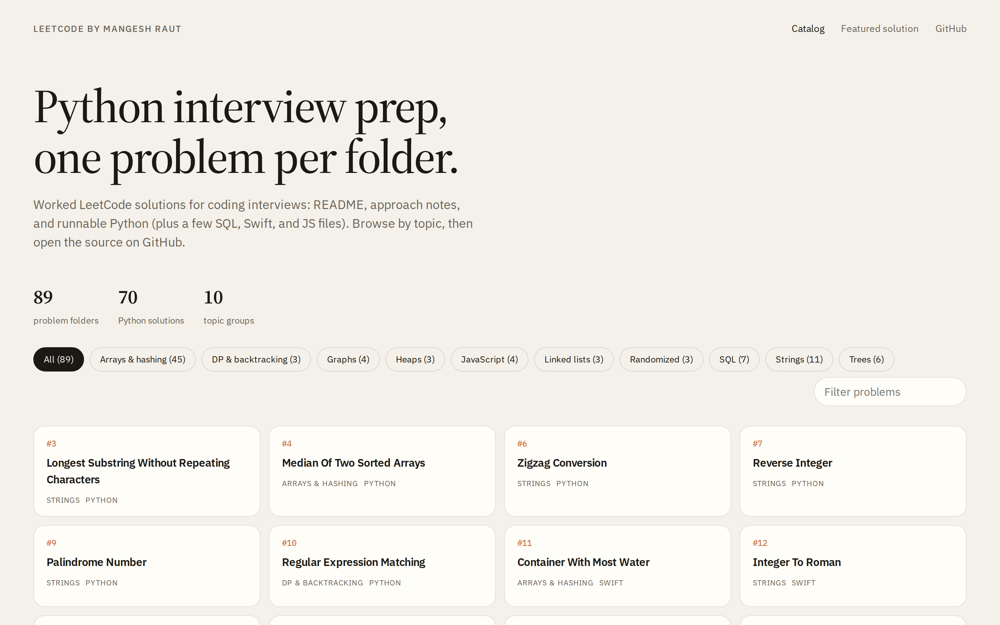
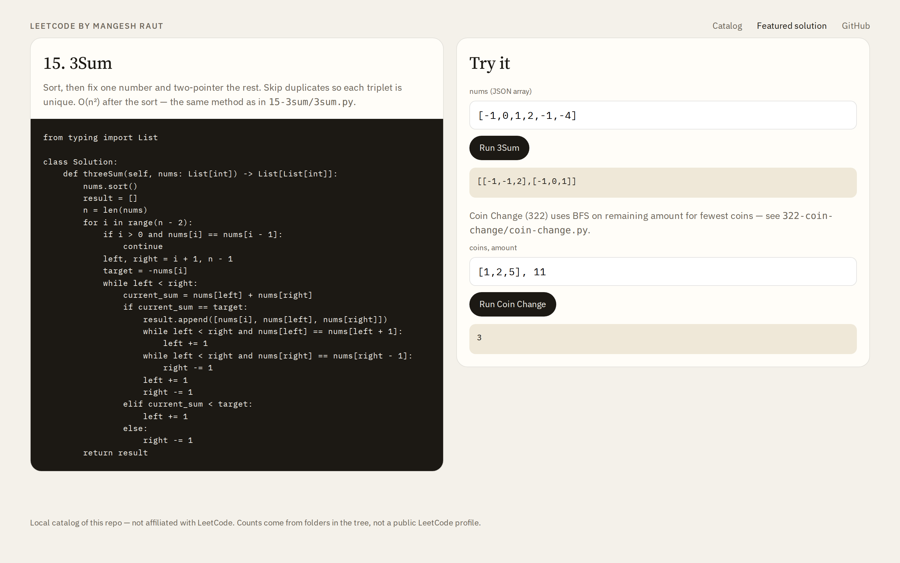

# LeetCode by Mangesh

Python-first **interview prep catalog** by [Mangesh Raut](https://github.com/mangeshraut712): one folder per LeetCode problem, each with a `README.md` (prompt) and a working solution (mostly `.py`).

This is a local solutions archive for studying patterns — arrays, strings, trees, graphs, DP, SQL — not a live LeetCode profile and not a scoreboard.

## Screenshots

Catalog home (topic filters + problem cards):



Featured 3Sum / Coin Change runner (same algorithms as the Python files):



## How it is organized

```
<id>-<slug>/
  README.md          # problem statement
  <slug>.py          # Solution class (typical)
```

A few folders use SQL, Swift, Java, C++, or JavaScript instead of Python. Two folders currently have a README only (`2856-count-complete-subarrays-in-an-array`, `3171-minimum-equal-sum-of-two-arrays-after-replacing-zeros`).

Folder names are the source of truth for what is covered. Derived topic groups from this tree:

| Topic | Folders |
| --- | ---: |
| Arrays & hashing | 45 |
| Strings | 11 |
| SQL | 7 |
| Trees | 6 |
| Graphs | 4 |
| JavaScript | 4 |
| DP & backtracking | 3 |
| Heaps | 3 |
| Linked lists | 3 |
| Randomized | 3 |

**89** problem folders · **70** Python solutions.

## Run a sample

Python 3, no extra packages:

```bash
python3 examples/run_3sum.py
```

That loads `15-3sum/3sum.py` and prints the three official sample cases. Any other folder works the same way: open the `.py`, instantiate `Solution`, call the method.

## Browse the catalog

Static gallery (no build step):

```bash
python3 -m http.server 8000
```

Then open [http://localhost:8000/docs/](http://localhost:8000/docs/) — catalog on `/`, featured runner at `/docs/#solution`.

If GitHub Pages is enabled for this repo (`/docs` on `main`), the same page is meant to live at [https://mangeshraut712.github.io/LeetCodeByMangesh/](https://mangeshraut712.github.io/LeetCodeByMangesh/).
