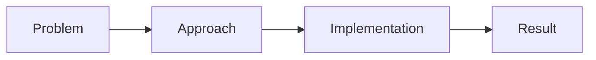

---

<!-- codex:project-diagram:start -->

## Project Diagram

```mermaid
flowchart LR
    A["Problem"] --> B["Approach"]
    B --> C["Implementation"]
    C --> D["Result"]
```

_Simple view of how problems move from approach to coded solution._

<!-- codex:project-diagram:end -->
